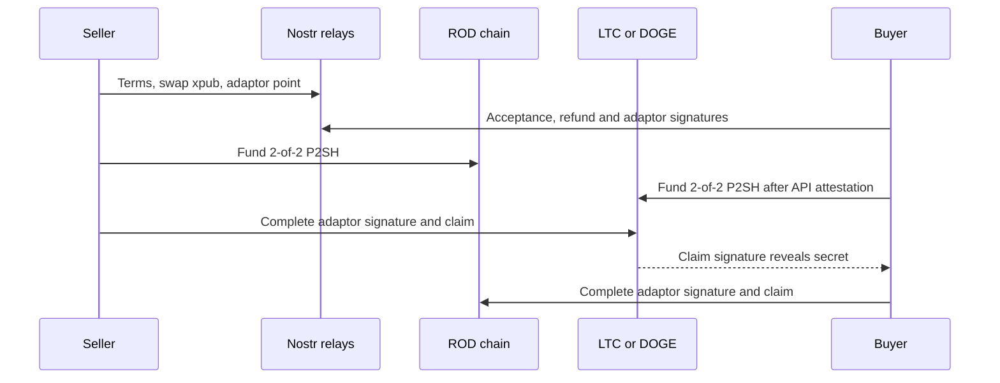

# Applied Cryptography and Security Assessment: `bellodox/rod-web-swap`

**Assessment date:** 2026-07-31  
**Repository:** `bellodox/rod-web-swap`  
**Reviewed ref:** default branch `beta.1`  
**Reviewed commit:** [`cb136d791c836c704a122278d00c7bfefde1a8b0`](https://github.com/bellodox/rod-web-swap/tree/cb136d791c836c704a122278d00c7bfefde1a8b0)  
**Assessment type:** source-assisted applied cryptography, protocol, key-management, and operational security review  
**Verdict:** **Not suitable for production or meaningful-value swaps.** The repository itself gives the same warning: it is experimental, unaudited, and testing-only ([README](https://github.com/bellodox/rod-web-swap/blob/cb136d791c836c704a122278d00c7bfefde1a8b0/README.md#L12-L21)).

## Executive Summary

The project has several sound building blocks: browser CSPRNG use fails closed, private scalars are rejection-sampled, Nostr events are BIP340-style signed, swap terms are canonically hashed, each side rebuilds transaction templates locally, and both refunds are fully signed before funding. The ECDSA adaptor construction also follows the expected algebraic shape and carries a DLEQ proof.

Those strengths do not make the end-to-end swap atomic. Four critical issues dominate the assessment:

1. A validly signed counterparty relay message can mark a live swap `COMPLETE`, declined, or refunded without independent chain proof. That stops the local safety automation and can let the sender take the other chain while later refunding its own chain.
2. The default ROD release delay and alt-chain refund delay are both approximately one hour. The seller can reveal the adaptor secret at almost the same time the buyer's alt refund becomes valid, creating a claim-versus-refund race in which the buyer may learn the secret, win the alt refund, and claim ROD.
3. A single chain API is treated as the truth source. A compromised ROD API can fabricate the seller's funding transaction and confirmations, causing the buyer to fund LTC/DOGE when no ROD escrow exists.
4. The wallet's master private scalar is stored in plaintext in `localStorage`. Any same-origin script execution, compromised update, browser extension with page access, or local-profile compromise can steal every wallet and swap key.

The first production decision should be a stop-ship for meaningful funds. The highest-priority engineering work is to make all safety states chain-derived, redesign the timeout inequalities, replace explorer trust with independently validated nodes, and move signing keys out of the browser's DOM and Web Storage. The adaptor protocol should then receive an independent cryptographic review and be moved to a reviewed constant-time implementation.

## Scope and Method

This review reconstructed the workflow from the browser UI, swap state machine, transaction builders, Nostr transport, adaptor-signature implementation, persistence layer, Electron wrapper, RPC helper, tests, and CI/release workflows. It also compared the implementation with relevant NIST, OWASP, W3C, GitHub Actions, Electron, Nostr, and Bitcoin protocol guidance.

The review did not perform a live mainnet swap, compromise a public endpoint, audit the ROD consensus implementation, or prove the adaptor construction formally. It is therefore a risk assessment and code audit, not a attestation or proof of security.

## Reconstructed OTC Workflow

1. An order is published in the ROD name/value database. Public Nostr events carry order detail and bilateral protocol messages.
2. Each wallet deterministically derives a swap account from the wallet scalar, publishes the account xpub, and derives a non-hardened child at an index computed from `swapId` ([derivation](https://github.com/bellodox/rod-web-swap/blob/cb136d791c836c704a122278d00c7bfefde1a8b0/js/otc-engine.js#L185-L200), [child derivation](https://github.com/bellodox/rod-web-swap/blob/cb136d791c836c704a122278d00c7bfefde1a8b0/js/otc-swap.js#L123-L175)). The same child public key is used on ROD and the alt chain.
3. The seller generates adaptor secret `t` and publishes `T = tG`. Both parties derive deterministic 2-of-2 legacy P2SH escrows and transaction templates from canonical terms.
4. Before either funding transaction is broadcast, the parties plan its txid, construct absolute-`nLockTime` refund transactions, exchange normal ECDSA signatures, and retain fully signed refunds.
5. They exchange adaptor signatures: the buyer gives the seller an alt-claim signature encrypted under `T`; the seller gives the buyer a ROD-claim signature encrypted under `T`.
6. After both report `PREPARED`, the seller funds ROD. The buyer queries the configured ROD API for the planned output and confirmations, then funds LTC/DOGE. The seller similarly verifies the alt leg.
7. At `releaseRodHeight`, the seller completes and broadcasts the alt claim using `t`. The completed ECDSA signature exposes `t` relative to the buyer's adaptor signature.
8. The buyer recovers `t`, completes the seller's ROD adaptor signature, and claims ROD.
9. Failure paths use the buyer's earlier alt refund and the seller's later ROD refund.

## Security Objectives

| Objective | Intended status | Assessment |
| --- | --- | --- |
| Atomic fair exchange | Primary objective | Not achieved under the default timing, terminal-message, and chain-oracle behavior. |
| Integrity of terms | Strongly intended | Canonical terms hashing and local reconstruction are good controls. |
| Peer authenticity | Intended | Signed Nostr events are bound to the counterparty's ROD identity, but identity is only a blockchain-key identity, not a legal identity. |
| Authorization | Intended | Message signer authentication exists, but message types are not sufficiently authorized by role, state, or chain evidence. |
| Asset confidentiality | Essential | Not achieved for private keys because the master scalar is stored in plaintext browser storage. |
| Negotiation confidentiality | Not implemented | Nostr payloads, tags, amounts, xpubs, and txids are public. |
| Privacy and unlinkability | Claimed in the specification | Not achieved. Public xpubs and relay transcripts directly link identities, orders, chains, amounts, and transactions. |
| Forward secrecy | Not implemented | No forward secrecy or post-compromise security exists for relay messages. |
| Availability and recovery | Intended | Pre-signed refunds help, but fixed fees, browser liveness, API dependence, and remote terminal states can disable recovery. |
| Non-repudiation | Partial | Signatures and on-chain transactions provide key-control evidence, but not attested human/legal identity. This also conflicts with privacy. |
| Compliance | Unspecified | No FIPS, ISO 27001, or regulated-custody claim can be supported from the repository. |

## Threat Model

### Assets

- Master wallet scalar/WIF and every derived spend key
- Per-swap child private keys, adaptor secret, pre-signed refunds, and adaptor signatures
- ROD, LTC, and DOGE escrow outputs
- Canonical terms, payout addresses, xpubs, and transaction identifiers
- Live safety state, refund timers, and recovery backups
- Local ROD RPC credentials and any release-signing credentials
- User privacy, trading intent, amounts, counterparties, and transaction graph

### Attackers and Likely Paths

| Attacker | Capability | Likely path |
| --- | --- | --- |
| Malicious seller | Sends valid protocol messages, controls secret `t`, chooses when to claim alt | False terminal message; fabricated API-assisted funding; claim near refund boundary; withhold messages. |
| Malicious buyer | Holds fully signed alt refund and receives `t` from seller claim | Race refund against seller claim, then use observed `t` to claim ROD. |
| Compromised chain API/explorer | Returns arbitrary tips, transactions, output data, and confirmations | Fabricate funding evidence, suppress spends, delay refund, or induce unsafe progression. |
| Malicious or unreliable relay | Reorders, replays, withholds, correlates, and retains events | State desynchronization, denial of service, transcript surveillance; cannot forge an honest peer's signature. |
| Same-origin code attacker | Executes JavaScript through XSS, compromised hosting, service worker, or dependency | Read plaintext master key from `localStorage`/DOM and sign arbitrary transactions. |
| Local attacker or extension | Reads browser profile, storage, page DOM, or memory | Steal keys, RPC credentials, sessions, and recovery artifacts. |
| Miner or chain attacker | Reorgs, censors, chooses conflicts, ignores first-seen policy | Win claim/refund races, mutate legacy funding txids, or keep fixed-fee safety transactions unconfirmed. |
| Supply-chain attacker | Modifies dependencies, build workflow, release artifact, or hosted JavaScript | Ship a wallet that exfiltrates all keys or transaction approvals. |

### Trust Boundaries and Unsafe Assumptions

- The browser origin is effectively a custody boundary, but it also renders network-supplied data and persists the master key.
- HTTPS authenticates the configured API server; it does not prove that the server's chain answer is true.
- A Nostr signature proves who sent a message; it does not prove the reported settlement state.
- Mempool first-seen and standardness behavior are policy, not consensus.
- Expected block intervals are averages, not cross-chain clocks or deadline guarantees.
- A checksum proves accidental-corruption detection, not malicious backup integrity.
- An xpub is not secret, but a public non-hardened xpub plus one leaked child private key compromises the corresponding account private key ([BIP32](https://bips.dev/32/)).

## Cryptographic Design Review

### Controls That Are Directionally Sound

- `crypto.getRandomValues` is required and failure is fatal; key generation rejection-samples the secp256k1 scalar range ([randomness](https://github.com/bellodox/rod-web-swap/blob/cb136d791c836c704a122278d00c7bfefde1a8b0/js/coin.js#L271-L295), [private keys](https://github.com/bellodox/rod-web-swap/blob/cb136d791c836c704a122278d00c7bfefde1a8b0/js/coin.js#L465-L478)).
- Ordinary transaction ECDSA uses deterministic nonces and low-S normalization.
- The adaptor signature has the expected `R' = kG`, `R = kT`, `s' = k^-1(m + rx)` construction, a DLEQ proof, completed-signature attestation, and `+/-t` recovery for low-S normalization ([adaptor implementation](https://github.com/bellodox/rod-web-swap/blob/cb136d791c836c704a122278d00c7bfefde1a8b0/js/ecdsa-adaptor.js#L82-L246)).
- The adaptor nonce is domain-separated and mixed with auxiliary randomness, the signing key, message, and adaptor point ([nonce generation](https://github.com/bellodox/rod-web-swap/blob/cb136d791c836c704a122278d00c7bfefde1a8b0/js/coin.js#L426-L448)).
- Nostr signing follows BIP340's tagged-hash and even-Y construction and uses fresh auxiliary randomness ([Nostr signing](https://github.com/bellodox/rod-web-swap/blob/cb136d791c836c704a122278d00c7bfefde1a8b0/js/otc-nostr.js#L86-L125), [BIP340](https://bips.dev/340/)).
- Canonical terms include chain, amounts, keys, destinations, fees, confirmation requirements, and deadlines. A hash mismatch fails closed.
- Each receiver rebuilds refund and claim templates and verifies signatures against its own sighash rather than accepting a remote transaction template.
- Fully signed refunds are required before either funding transaction is broadcast.

### Design Concerns

- All secp256k1 and adaptor math is custom, variable-time JavaScript using legacy big-integer code. The standard WebCrypto ECDSA interface only specifies P-256, P-384, and P-521, not secp256k1, so "move it to WebCrypto" is not an available direct fix ([W3C WebCrypto](https://www.w3.org/TR/webcrypto/#ecdsa-operations)).
- The protocol has no normative transcript/state specification or proof of atomicity under reordering, chain stalls, reorgs, fee pressure, or malicious counterparty timing.
- The security property depends on state transitions, independent chain truth, and deadline inequalities. Those are weaker than the core elliptic-curve equations.
- Legacy P2SH makes planned funding txids consensus-malleable where SegWit is unavailable or unused. BIP65 specifically notes that pre-signed `nLockTime` refunds are vulnerable to transaction malleability ([BIP65](https://bips.dev/65/)).
- Fixed `SIGHASH_ALL` claim/refund transactions have fixed fees. There is no general RBF or CPFP recovery design, even though replacement and relay are policy-dependent ([BIP125](https://bips.dev/125/)).

## Key Management Assessment

| Lifecycle area | Current behavior | Risk |
| --- | --- | --- |
| Generation | CSPRNG for random keys; optional deterministic email/password wallet | Random generation is sound; the brainwallet path is not. |
| Root storage | Raw master private scalar stored in `localStorage` and rendered into a DOM input | Direct wallet compromise from any same-origin script or local profile access. |
| Derivation | Custom swap root from wallet scalar, public account xpub, non-hardened per-swap child | Cross-swap blast radius if a child private key leaks; no chain separation. |
| Key usage | Wallet key is also the Nostr identity; one swap child key is used on both chains | Cross-protocol and cross-chain compromise and correlation. |
| Session storage | Child key, adaptor secret, and Nostr key encrypted with a passphrase equal to the WIF | Encryption depends on an already exposed master secret and uses a legacy non-AEAD passphrase interface. |
| Backup/recovery | Portable session backup omits WIF/RPC credentials and includes signed refunds | Good scope reduction, but integrity is only an unkeyed checksum and recovery drills are not operationally evidenced. |
| Rotation/revocation | No explicit lifecycle | Blockchain spend keys cannot be revoked; compromise response requires sweeping funds and replacing identities/orders. |
| HSM/KMS | None | Ordinary cloud KMS/HSM products generally do not implement adaptor ECDSA, so a reviewed isolated signer or specialized module is needed. |
| Separation of duties | UI, networking, state machine, chain oracle, and signing share one renderer | One renderer compromise defeats all controls. |

[NIST SP 800-57 Part 1 Rev. 5](https://csrc.nist.gov/pubs/sp/800/57/pt1/r5/final) requires protection and lifecycle planning appropriate to each type of key material. The current browser-root design does not provide that separation or protection.

## Findings Summary

| ID | Severity | Finding |
| --- | --- | --- |
| C-01 | Critical | Counterparty messages can force terminal state and stop local safety automation without chain proof |
| C-02 | Critical | Default release and alt-refund deadlines collide, creating a secret-revelation race |
| C-03 | Critical | One chain API can fabricate funding evidence and defeat atomicity |
| C-04 | Critical | Master wallet scalar is persisted plaintext in browser storage |
| H-01 | High | Email/password brainwallet uses only 51 fast SHA-256 rounds and no random salt |
| H-02 | High | Custom variable-time JavaScript implements both adaptor ECDSA and BIP340 signing |
| H-03 | High | Keys are reused across wallet identity, Nostr, chains, and swaps with a public non-hardened xpub |
| H-04 | High | Legacy planned txids and fixed-fee pre-signed transactions can break liveness and recovery |
| H-05 | High | Local RPC CORS proxy reflects arbitrary origins while allowing credentials |
| H-06 | High | Privileged `workflow_run` jobs execute untrusted head commits with release secrets and artifact publication |
| M-01 | Medium | Relay sequence/hash-chain fields and state persistence lack enforceable integrity semantics |
| M-02 | Medium | Public relay transcripts provide no negotiation confidentiality, unlinkability, or forward secrecy |
| M-03 | Medium | Confirmation defaults and reorg policy are not appropriate for unspecified OTC value |
| M-04 | Medium | Desktop/web hardening and dependency posture are below a custody application's bar |
| M-05 | Medium | Technical specification diverges from the runtime and can create false assurance |
| L-01 | Low | The local fast-test entry point depends on an executable bit absent from the reviewed tree |

## Detailed Findings

### C-01: Counterparty Messages Can Disable Safety Automation

**Issue.** A signed counterparty `swap_complete`, `swap_decline`, or refund-status message can directly set a terminal condition without independent chain validation. Terminal sessions stop automatic settlement/refund progression and are removed from relay tracking ([message handlers](https://github.com/bellodox/rod-web-swap/blob/cb136d791c836c704a122278d00c7bfefde1a8b0/js/otc-app-ui.js#L3277-L3284), [terminal updates](https://github.com/bellodox/rod-web-swap/blob/cb136d791c836c704a122278d00c7bfefde1a8b0/js/otc-app-ui.js#L3399-L3434), [terminal predicate](https://github.com/bellodox/rod-web-swap/blob/cb136d791c836c704a122278d00c7bfefde1a8b0/js/otc-app-ui.js#L1732-L1737), [cleanup](https://github.com/bellodox/rod-web-swap/blob/cb136d791c836c704a122278d00c7bfefde1a8b0/js/otc-engine.js#L1457-L1479)).

**Why it matters.** Authentication proves the sender; it does not make the sender's claim true. Safety-critical local action must not be remotely cancelable after funds are committed.

**Exploitation scenario.** After both legs are funded, a malicious seller sends `swap_complete`. The buyer stops polling and refund/secret-recovery automation. At release height the seller claims the buyer's alt output, revealing `t`; the buyer does not recover it; the seller later refunds its ROD output.

**Recommended remediation.** Treat all relay settlement messages as hints. Derive `COMPLETE`, refund, and outpoint-resolved states only from locally attested chain data. Create a separate safety supervisor that continues monitoring both outpoints until each is confirmed spent. Enforce a role/type/current-state transition matrix and reject impossible, stale, or premature messages.

**Residual risk.** Independent chain observation can still be delayed or partitioned. The watchdog needs redundant nodes, durable local state, user alerts, and a manual raw-transaction recovery path.

### C-02: Release and Alt Refund Deadlines Collide

**Issue.** Defaults set ROD release to 120 blocks (about one hour), LTC refund to 24 blocks (about one hour), and DOGE refund to 60 blocks (about one hour) ([defaults](https://github.com/bellodox/rod-web-swap/blob/cb136d791c836c704a122278d00c7bfefde1a8b0/js/otc-engine.js#L20-L58)). The seller waits for the ROD release height before revealing `t`, while the buyer automatically broadcasts its alt refund at the alt lock height ([seller claim](https://github.com/bellodox/rod-web-swap/blob/cb136d791c836c704a122278d00c7bfefde1a8b0/js/otc-app-ui.js#L2332-L2362), [buyer refund](https://github.com/bellodox/rod-web-swap/blob/cb136d791c836c704a122278d00c7bfefde1a8b0/js/otc-app-ui.js#L2499-L2534)). The implemented safety check only requires ROD refund to be later than alt refund; it does not place alt refund safely after the seller's latest claim time ([ordering check](https://github.com/bellodox/rod-web-swap/blob/cb136d791c836c704a122278d00c7bfefde1a8b0/js/otc-swap.js#L243-L282)).

**Why it matters.** The secret must not become observable unless the seller's alt claim has enough time to become irreversible before the buyer refund is valid.

**Exploitation scenario.** At the boundary, the seller broadcasts the completed alt claim and reveals `t` in the mempool. The buyer broadcasts the already signed refund. If a miner confirms the refund conflict instead, the buyer keeps/refunds the alt asset and uses `t` to claim ROD.

**Recommended remediation.** Remove the release wait unless it is a hard business requirement; claim immediately after both fundings reach the agreed finality. Otherwise enforce, using fresh tips immediately before signing and funding:

`T_release + propagation + alt_claim_confirmations + alt_reorg_margin < T_alt_refund`

`T_alt_refund + recovery + ROD_claim_confirmations + ROD_reorg_margin < T_ROD_refund`

Add a hard latest-safe-claim height before which the seller must broadcast and after which it must only refund. Test adversarial boundary schedules, chain stalls, and conflicting spends.

**Residual risk.** Block production and censorship are stochastic. Conservative margins reduce but cannot eliminate chain-level failure; trade-size limits and emergency fee escalation remain necessary.

### C-03: A Single Chain API Can Defeat Atomicity

**Issue.** The browser queries one configured endpoint for chain tips and transaction data, then labels the result `verifiedLocally` merely because this browser made the API call ([API access](https://github.com/bellodox/rod-web-swap/blob/cb136d791c836c704a122278d00c7bfefde1a8b0/js/otc-engine.js#L220-L240), [funding lookup](https://github.com/bellodox/rod-web-swap/blob/cb136d791c836c704a122278d00c7bfefde1a8b0/js/otc-engine.js#L831-L870), [attestation flag](https://github.com/bellodox/rod-web-swap/blob/cb136d791c836c704a122278d00c7bfefde1a8b0/js/otc-app-ui.js#L1676-L1686)).

**Why it matters.** Server-authenticated HTTPS data is not a consensus proof. The buyer's decision to fund the alt leg depends on this answer.

**Exploitation scenario.** A compromised ROD API returns the planned txid, expected P2SH output, and sufficient confirmations even though no such transaction exists. The buyer broadcasts LTC/DOGE. The seller already knows `t` and has the buyer's adaptor signature, so it claims the alt output without ever locking ROD.

**Recommended remediation.** Use self-hosted fully validating nodes for every settlement chain through an authenticated local bridge. At minimum, require independent provider quorum plus locally validated headers and Merkle proofs, pin chain/genesis/network identity, and fail closed on disagreement. Explorer data should never be the sole authorization for funding.

**Residual risk.** Multiple providers can share infrastructure or the same bad chain view. Only a validating node removes provider truth as the primary trust assumption; consensus reorg risk remains.

### C-04: Master Wallet Scalar Is Stored Plaintext

**Issue.** `saveWalletSession()` writes the raw network-agnostic private scalar to `localStorage`, restores it automatically, and renders WIF into a DOM input ([wallet persistence](https://github.com/bellodox/rod-web-swap/blob/cb136d791c836c704a122278d00c7bfefde1a8b0/js/coinbin.js#L213-L299), [DOM rendering](https://github.com/bellodox/rod-web-swap/blob/cb136d791c836c704a122278d00c7bfefde1a8b0/js/coinbin.js#L418-L429)). OWASP notes that `localStorage` persists after the browser closes and is directly inspectable/editable ([OWASP Browser Storage](https://owasp.org/www-project-web-security-testing-guide/stable/4-Web_Application_Security_Testing/11-Client-side_Testing/12-Testing_Browser_Storage)).

**Why it matters.** This is the root key for wallet funds, Nostr identity, and every swap key. One browser-origin compromise becomes total custody compromise.

**Exploitation scenario.** A compromised service-worker update or DOM XSS reads the storage item, derives chain WIFs, and sweeps every supported asset. Logout after the event does not recover stolen keys.

**Recommended remediation.** Do not persist raw spend keys in Web Storage or DOM. Move signing to an isolated native process or specialized reviewed signer, backed by an OS keystore/secure element where feasible. Use a dedicated, low-balance swap root. Require explicit unlock and transaction confirmation. For fallback software custody, encrypt an authenticated vault with a random data key protected by the OS keystore or Argon2id-derived KEK, while acknowledging that XSS can still steal an unlocked key.

**Residual risk.** Any software signer can be abused while unlocked. A trusted display and strict transaction policy are needed to resist a compromised UI.

### H-01: Weak Brainwallet Derivation

**Issue.** The optional email/password wallet concatenates predictable fields and performs only 51 SHA-256 rounds, without a random per-wallet salt, before deriving the master key ([brainwallet path](https://github.com/bellodox/rod-web-swap/blob/cb136d791c836c704a122278d00c7bfefde1a8b0/js/coinbin.js#L470-L516)).

**Why it matters.** The public address provides an offline password-check oracle. Composition rules do not create high entropy, and SHA-256 is intentionally fast.

**Exploitation scenario.** An attacker enumerates known email addresses and breached/common password patterns on GPUs until a derived address matches an observed wallet, then spends all assets.

**Recommended remediation.** Remove direct password-to-wallet derivation. Generate a random seed from the CSPRNG, back it up as a standard mnemonic where compatible, and only use the password to unlock an encrypted vault. OWASP recommends Argon2id with a unique salt for password-based protection ([OWASP Password Storage](https://cheatsheetseries.owasp.org/cheatsheets/Password_Storage_Cheat_Sheet.html)).

**Residual risk.** User-chosen unlock passwords can still be weak; hardware-backed rate limiting and high-entropy recovery material are preferable.

### H-02: Custom Variable-Time Browser Cryptography

**Issue.** Adaptor ECDSA, DLEQ, BIP340, point parsing, scalar inversion, and multiplication run in handwritten JavaScript over legacy `jsbn`/elliptic-curve primitives. There is no independent audit or broad interoperability corpus.

**Why it matters.** A subtle arithmetic, parsing, nonce, or transcript error can invalidate atomicity or leak a private key. Secret-dependent big-integer operations are not designed as constant-time primitives.

**Exploitation scenario.** A crafted counterparty point/signature reaches an untested parser edge, or a co-resident execution context measures signing behavior and recovers information about a long-lived scalar. A correctness bug can also create an adaptor signature that passes one side's implementation but fails on settlement.

**Recommended remediation.** Specify the construction normatively, publish cross-implementation test vectors, obtain an independent cryptographic review, fuzz all parsers and scalar boundaries, and move operations to a reviewed constant-time secp256k1/adaptor implementation in a native isolated process or carefully reviewed WASM build. Bitcoin Core's `libsecp256k1` is an example of a library designed for high-assurance secp256k1 operations ([libsecp256k1](https://github.com/bitcoin-core/secp256k1)).

**Residual risk.** A reviewed primitive does not fix the protocol timing and state-machine flaws. WASM also does not automatically provide constant-time behavior across all browser engines.

### H-03: Cross-Protocol, Cross-Chain, and Cross-Swap Key Reuse

**Issue.** The wallet WIF scalar is also the Nostr identity ([Nostr identity](https://github.com/bellodox/rod-web-swap/blob/cb136d791c836c704a122278d00c7bfefde1a8b0/js/otc-nostr.js#L325-L337)); the deterministic swap root comes from the same wallet scalar; one non-hardened child key is reused on ROD and LTC/DOGE; and the account xpub is public.

**Why it matters.** A bug in the least mature protocol surface can compromise a spend identity. Public xpub plus a leaked non-hardened child private key compromises all children under that swap account. Reuse also makes cross-chain correlation trivial.

**Exploitation scenario.** A per-swap child key leaks from browser memory or a diagnostic artifact. The attacker combines it with the public account xpub to recover the swap account private key and derives every swap child.

**Recommended remediation.** Use separate domain-separated hardened roots for wallet custody, Nostr identity, ROD swaps, and each alt chain. Publish per-order/per-swap child public keys, not a reusable account xpub. Bind short-lived communication and swap keys to a durable identity with a one-time signature.

**Residual risk.** Public blockchain transactions remain linkable through amount/timing analysis, and compromise of a durable binding key still permits impersonation until orders are revoked.

### H-04: Planned Legacy Txids and Fixed Fees Threaten Recovery

**Issue.** Refund/adaptor signatures bind planned funding txids before broadcast, but the escrows use legacy P2SH even on Litecoin. Claim and refund fees are fixed into `SIGHASH_ALL` transactions ([transaction builders](https://github.com/bellodox/rod-web-swap/blob/cb136d791c836c704a122278d00c7bfefde1a8b0/js/otc-engine.js#L1053-L1119)). The project correctly acknowledges legacy txid malleability is controlled by policy rather than consensus ([README caveat](https://github.com/bellodox/rod-web-swap/blob/cb136d791c836c704a122278d00c7bfefde1a8b0/README.md#L283-L293)).

**Why it matters.** A mutated funding txid invalidates every pre-signed child transaction. Fee spikes or relay-policy changes can keep the only valid claim/refund below miners' acceptance thresholds until a safety deadline passes.

**Exploitation scenario.** A miner confirms a semantically equivalent legacy funding transaction with a different txid, or congestion makes the fixed-fee refund non-relayable. The user has no unilateral fee-bump path and funds stay locked or are lost to the counterparty's later path.

**Recommended remediation.** Use SegWit P2WSH for ROD/LTC where consensus and wallet support are verified. Treat DOGE as a separate legacy protocol profile with larger confirmation and timeout margins. Design CPFP anchor outputs or a reviewed pre-signed fee ladder, validate current mempool policy before funding, and monitor propagation across independent nodes.

**Residual risk.** Dogecoin's legacy transaction model cannot provide SegWit txid stability. Fee markets and miner policy can always impair liveness.

### H-05: RPC CORS Proxy Exposes Node Authority to Arbitrary Origins

**Issue.** The helper reflects the request `Origin`, sets `Access-Control-Allow-Credentials: true`, accepts arbitrary request paths/bodies, and forwards authorization headers to the configured ROD Core endpoint ([CORS policy](https://github.com/bellodox/rod-web-swap/blob/cb136d791c836c704a122278d00c7bfefde1a8b0/tools/rod-rpc-cors-proxy.js#L55-L64), [forwarding](https://github.com/bellodox/rod-web-swap/blob/cb136d791c836c704a122278d00c7bfefde1a8b0/tools/rod-rpc-cors-proxy.js#L82-L105), [server](https://github.com/bellodox/rod-web-swap/blob/cb136d791c836c704a122278d00c7bfefde1a8b0/tools/rod-rpc-cors-proxy.js#L192-L205)). RPC credentials are also stored in plaintext configuration.

**Why it matters.** A malicious website can target a loopback service and potentially read or invoke node RPC with browser-cached or configured credentials.

**Exploitation scenario.** While the proxy is running, the operator visits an attacker page. The page sends credentialed requests to the loopback proxy, reads the permissive CORS response, and invokes wallet/name RPC methods.

**Recommended remediation.** Enforce an exact origin allowlist, a random per-launch bearer capability, strict RPC method allowlisting, request-size limits, loopback binding, and CSRF protection. Do not put Basic credentials in URLs or Web Storage. Prefer a narrow native IPC bridge over a generic HTTP proxy.

**Residual risk.** Local malware can access loopback and process credentials. OS-level access controls and a locked node wallet are still required.

### H-06: Privileged CI Executes Untrusted Commits

**Issue.** The upstream proof harness runs on pull requests ([proof workflow](https://github.com/bellodox/rod-web-swap/blob/cb136d791c836c704a122278d00c7bfefde1a8b0/.github/workflows/proof-harness.yml#L1-L5)). The downstream Electron and release workflows then use `workflow_run` for every branch, check out the triggering `head_sha`, run `npm ci` and repository scripts, expose optional signing secrets, and later publish artifacts ([build workflow](https://github.com/bellodox/rod-web-swap/blob/cb136d791c836c704a122278d00c7bfefde1a8b0/.github/workflows/electron-build.yml#L1-L79), [release workflow](https://github.com/bellodox/rod-web-swap/blob/cb136d791c836c704a122278d00c7bfefde1a8b0/.github/workflows/release-desktop.yml#L1-L119)). GitHub explicitly warns that privileged `workflow_run` combined with checkout of untrusted pull-request content can expose secrets and repository authority ([GitHub secure use](https://docs.github.com/en/actions/reference/security/secure-use#mitigating-the-risks-of-untrusted-code-checkout)).

**Why it matters.** Wallet release signing and distribution are cryptographic trust roots. A malicious build can steal signing credentials or produce a key-stealing wallet.

**Exploitation scenario.** A pull request changes `electron/package.json` to add an install/package script that exfiltrates `CSC_LINK` or other signing secrets. The upstream harness passes, the privileged downstream workflow checks out that head SHA, and the script runs.

**Recommended remediation.** Never execute untrusted head code in a privileged `workflow_run`. Build pull requests in an unprivileged workflow with no secrets. Build releases only from protected tags/commits on the trusted default branch after review, use environment approvals for signing, pin actions by full commit SHA, generate signed provenance/SBOMs, and publish only signed/notarized artifacts.

**Residual risk.** Trusted maintainer compromise and dependency compromise remain. Reproducible builds, multi-party release approval, and independent signature attestation reduce this risk.

### M-01: Transcript and Persisted-State Integrity Is Incomplete

**Issue.** Messages carry `sequence` and `previousEventId`, but validation only checks that sequence is a number; no monotonic per-sender sequence, previous-event chain, expiry, or state authorization is enforced ([envelope](https://github.com/bellodox/rod-web-swap/blob/cb136d791c836c704a122278d00c7bfefde1a8b0/js/otc-nostr.js#L131-L160), [validation](https://github.com/bellodox/rod-web-swap/blob/cb136d791c836c704a122278d00c7bfefde1a8b0/js/otc-nostr.js#L247-L268)). Session secrets use CryptoJS's legacy passphrase API rather than an explicit memory-hard KDF plus AEAD. Recovery checksums are unkeyed hashes.

**Why it matters.** Relays can replay/reorder old valid events after reload, and malicious local tampering is not authenticated. State corruption can suppress recovery or induce impossible transitions.

**Exploitation scenario.** A relay replays an old signed decline or state message after the in-memory seen cache is lost, or local malware edits a recovery object and recomputes its unkeyed checksum.

**Recommended remediation.** Sign a domain-separated transcript containing protocol version, both chain IDs/genesis hashes, terms hash, role, type, per-sender sequence, previous event ID, payload hash, and expiry. Persist state in an AEAD-protected store and recompute all scripts, txids, deadlines, and canonical terms on import.

**Residual risk.** A compromised unlocked endpoint can create valid new state. Chain-derived safety rules remain the final control.

### M-02: OTC Negotiation Is Public and Has No Forward Secrecy

**Issue.** Nostr tags expose swap ID, type, and sequence, while the complete JSON envelope is plaintext ([event construction](https://github.com/bellodox/rod-web-swap/blob/cb136d791c836c704a122278d00c7bfefde1a8b0/js/otc-nostr.js#L131-L160)). Public order xpubs and messages link parties, amounts, payout addresses, and ROD-to-alt txids.

**Why it matters.** OTC intent and transaction graph data may be commercially sensitive or regulated personal data. The technical specification's unlinkability claim is not supported by the runtime.

**Exploitation scenario.** A relay operator indexes events by swap ID and xpub, correlates them with both public chains, and reconstructs counterparties, timing, amounts, and outcomes.

**Recommended remediation.** Encrypt payloads using NIP-44 or another reviewed construction with per-swap ephemeral communication keys, minimize public tags, and publish per-order keys rather than an account xpub. If forward secrecy is required, add an ephemeral authenticated key exchange and ratchet; NIP-44 itself explicitly does not provide forward secrecy ([NIP-44 limitations](https://github.com/nostr-protocol/nips/blob/master/44.md#limitations)).

**Residual risk.** Relay IPs, event timing, sizes, and public chain activity remain observable even with encrypted content.

### M-03: Confirmation and Reorg Policy Is Not Value-Aware

**Issue.** Defaults accept one ROD confirmation and one Litecoin confirmation, with six for Dogecoin. There is no trade-value tiering, observed chain-work comparison, reorg response policy, or emergency pause.

**Why it matters.** OTC values are unspecified and may greatly exceed the economic cost of a short reorg or bribed miner. One confirmation is especially weak when a single API supplies the view.

**Exploitation scenario.** The buyer sees one fabricated or later-reorged ROD confirmation, funds the alt chain, and the seller claims alt after ROD funding disappears.

**Recommended remediation.** Set confirmation requirements by asset, amount, recent reorg depth, chain work/security budget, backend disagreement, and operational risk appetite. Freeze progression on reorg or tip disagreement and extend deadlines before funding if safety margins shrink.

**Residual risk.** No finite confirmation count gives absolute finality on proof-of-work chains.

### M-04: Runtime and Dependency Hardening Is Incomplete

**Issue.** The hosted CSP permits `unsafe-inline` and depends on a host honoring `_headers`; `file://`/Electron does not receive those deployment headers ([CSP](https://github.com/bellodox/rod-web-swap/blob/cb136d791c836c704a122278d00c7bfefde1a8b0/_headers#L1-L7)). Electron correctly enables isolation/sandbox and disables Node integration, but leaves DevTools enabled and uses the file protocol ([Electron window](https://github.com/bellodox/rod-web-swap/blob/cb136d791c836c704a122278d00c7bfefde1a8b0/electron/src/main.js#L121-L139)). The locked Electron `37.10.3` and build tree produced 17 high-severity `npm audit` dependency entries on the review date. Electron recommends a restrictive CSP, current Electron, context isolation, sandboxing, and avoiding `file://` ([Electron security checklist](https://www.electronjs.org/docs/latest/tutorial/security)). Release artifacts are unsigned; a checksum distributed beside an artifact detects corruption but does not authenticate the publisher.

**Why it matters.** This application's renderer holds spend authority. Browser/runtime or release compromise is wallet compromise.

**Exploitation scenario.** A vulnerable runtime or tampered unsigned installer executes code in the renderer and reads the plaintext wallet scalar.

**Recommended remediation.** Remove inline script dependencies and enforce CSP through both HTTP headers and Electron response/session controls. Use a custom privileged protocol, disable production DevTools, upgrade Electron and dependencies, sign/notarize all packages, provide reproducible-build attestations, and verify updates before execution.

**Residual risk.** A current runtime still has unknown vulnerabilities; custody isolation must not depend only on renderer hardening.

### M-05: Specification Diverges From Runtime

**Issue.** The PDF architecture describes IndexedDB backup and a Web Worker, while the runtime uses `localStorage` and performs cryptography in the main renderer. It recommends constant-time WebCrypto despite no standard secp256k1 WebCrypto support, labels an absolute-`nLockTime` test as CSV, and claims inter-chain unlinkability despite public xpub/transcript linkage ([technical specification](https://github.com/bellodox/rod-web-swap/blob/cb136d791c836c704a122278d00c7bfefde1a8b0/docs/technical_specification_rod_web_swap.pdf)).

**Why it matters.** Security reviewers and operators may approve assumptions or controls that are not present in the shipped code.

**Exploitation scenario.** An operator assumes secrets are isolated in a worker or structured store and deploys the web build with a risk model that excludes same-origin extraction.

**Recommended remediation.** Replace the PDF with a versioned normative protocol specification generated/reviewed alongside code. Include exact equations, encodings, state transitions, timeout inequalities, trust assumptions, and a security-claims matrix with implemented/tested status.

**Residual risk.** Accurate documentation does not itself establish correctness; it makes formal review and testing possible.

### L-01: Local Fast-Test Entry Point Is Not Directly Runnable

**Issue.** `tests/run-fast.sh` invokes `tests/harness/run-all.sh` as an executable, but the reviewed tree lacks the executable bit. CI compensates with `chmod`.

**Why it matters.** Local release attestation can fail before running security gates, encouraging inconsistent workarounds.

**Exploitation scenario.** A maintainer mistakes the permission failure for an environment issue and releases without completing the intended gate.

**Recommended remediation.** Commit executable modes for both scripts or invoke the nested script explicitly with `bash`; assert the entry point in release tests.

**Residual risk.** Passing tests still cover the modeled behavior, not the missing atomicity properties identified above.

## Operational Workflow Review

- **Logging:** Browser logs are useful for diagnosis but are not tamper-evident. Public Nostr messages create an involuntary external audit trail and privacy exposure. Secrets must never be added to centralized telemetry.
- **Monitoring:** The safety monitor is a browser timer. Browser sleep, tab closure, terminal-state messages, API outages, and storage corruption can stop it. A separate durable watchdog should track every funded outpoint until final resolution.
- **Incident response:** No repository evidence defines runbooks for API compromise, relay outage, reorg, stuck claim/refund, key compromise, malicious release, or disclosure. Each scenario needs an owner, detection signal, containment action, and tested recovery transaction path.
- **Secrets:** Wallet and RPC secrets are browser-local; release-signing secrets are referenced by CI. Neither design provides strong least privilege or rotation evidence.
- **Deployment:** The web build inherits the security of its origin and service-worker update path. Electron improves renderer isolation but distributes unsigned packages and currently uses a vulnerable dependency set.
- **Developer access:** Branch protection, CODEOWNERS, required reviews, and environment approvals are not visible in repository content and must be verified in GitHub settings.

## Standards and Best-Practice Mapping

| Guidance | Relevant expectation | Current gap |
| --- | --- | --- |
| [NIST SP 800-57](https://csrc.nist.gov/pubs/sp/800/57/pt1/r5/final) | Protect key material according to use; define lifecycle, compromise, backup, recovery, and access | Plaintext root key, cross-purpose reuse, no revocation/rotation plan, no isolated module |
| [NIST SP 800-218 SSDF](https://csrc.nist.gov/pubs/sp/800/218/final) | Secure design, protected builds, vulnerability response, and evidence throughout SDLC | No external crypto review/formal threat model, privileged untrusted builds, vulnerable runtime, unsigned artifacts |
| OWASP storage/key/password guidance | No sensitive plaintext browser storage; use strong password KDFs and authenticated storage | Raw scalar in `localStorage`; 51 SHA-256 brainwallet; legacy passphrase encryption |
| Electron security guidance | Current runtime, restrictive CSP, sandbox/isolation, safe protocol and navigation | Some strong defaults present; current runtime/CSP/file-protocol/release authenticity gaps remain |
| Nostr NIP-44 | Encrypted DMs with explicit limitations | Current payloads are plaintext; even NIP-44 alone would not provide forward secrecy |
| FIPS 140 / FIPS 186-5, if required | Approved algorithms in validated cryptographic modules | Custom JS secp256k1/adaptor implementation is not a validated module; this design cannot claim FIPS compliance |
| ISO/IEC 27001 | ISMS governance, access, supplier, incident, logging, and change controls | Repository evidence is insufficient to assess certification or control operation |

## Improved Workflow

### 1. Safety Architecture

- Split the system into an untrusted UI/coordinator and a trusted native signer/safety daemon.
- Keep durable encrypted state and refund transactions in the daemon, not the renderer.
- Make relay events advisory. Only independently verified chain facts may resolve a funded leg or stop its watchdog.
- Run a redundant outpoint monitor using local full nodes; alert the user well before every latest-safe-action deadline.
- Enforce transaction policy in the signer: exact chain/genesis, outpoint, script, amount, destination, fee range, terms hash, role, and state.

### 2. Protocol Redesign

- Remove delayed release if possible. Once both legs are confirmed and refunds are safe, the seller should claim promptly.
- Encode explicit latest-safe-claim and refund inequalities using fresh chain tips and conservative chain-specific margins.
- Sign a complete transcript with protocol version, role, chain IDs, terms hash, per-sender sequence, previous event, expiry, and payload hash.
- Use SegWit escrows where supported; define a separately reviewed legacy profile for DOGE.
- Add a fee-escalation design such as CPFP anchors or a reviewed fee ladder.
- Model the state machine and deadlines in TLA+/Apalache or an equivalent model checker, and use mutation/property tests for malicious messages, reorgs, stalls, and conflicting spends.

### 3. Cryptography and Keys

- Remove the brainwallet and plaintext browser key persistence.
- Use a CSPRNG-generated dedicated swap seed, isolated from the user's main wallet and capped by policy.
- Derive separate hardened roots for communication, ROD, and each alt chain; publish only per-order/per-swap public keys.
- Implement adaptor operations in an independently reviewed constant-time secp256k1 module with cross-implementation vectors.
- Protect local state with AEAD and a random data-encryption key, with a KEK in the OS keystore or derived using Argon2id.
- Use per-swap ephemeral encrypted messaging. Add a ratchet only if forward secrecy is an actual requirement.

### 4. Chain and Operations

- Require self-hosted validating nodes for production, with provider quorum only as a secondary health signal.
- Set confirmation counts and exposure caps by asset, trade value, reorg history, and backend health.
- Define emergency states for reorg, backend disagreement, fee rejection, and relay partition. Never remotely mark the local safety supervisor terminal.
- Produce signed, notarized, reproducible releases with SBOMs and provenance. Remove privileged execution of untrusted commits.
- Establish two-person release approval, dependency/vulnerability SLAs, external audit, bug bounty, and tested incident runbooks.

### 5. Simpler Alternative

If production safety is more important than scriptless on-chain privacy, consider replacing the custom adaptor flow with conventional audited HTLCs using hash preimages and conservative CLTV ordering on chains where the exact consensus behavior is verified. This sacrifices cross-chain unlinkability but greatly reduces custom cryptographic surface. If scriptless privacy remains a hard requirement, retain adaptor signatures only after independent protocol and implementation review.

## Priority Remediation Plan

| Priority | Action | Exit criterion |
| --- | --- | --- |
| P0 | Keep testing-only warning and prohibit meaningful funds | Product and release channels enforce value/testnet limits |
| P0 | Remove remote authority over terminal/safety state | Funded-leg watchdog ends only after local chain-confirmed resolution |
| P0 | Fix timeout model and add latest-safe-claim cutoff | Model/test proves both deadline inequalities under configured margins |
| P0 | Remove plaintext master key and brainwallet | Renderer/Web Storage contains no raw spend root; dedicated signer required |
| P0 | Replace single explorer authorization | Funding requires validating-node evidence and fails closed on disagreement |
| P1 | Audit and replace custom crypto implementation | Independent review, constant-time module, fuzzing, interoperable vectors |
| P1 | Add fee/malleability strategy | SegWit where possible; legacy and fee-bump recovery tested per chain |
| P1 | Repair privileged CI/release path | Trusted protected refs only; signed artifacts and provenance |
| P2 | Add encrypted per-swap messaging and privacy controls | Public transcript excludes terms/addresses/txids; metadata risk documented |
| P2 | Establish operational security program | Runbooks, alerts, ownership, release reviews, vulnerability SLAs, drills |

## Questions Required Before a Final Production Assessment

1. What are ROD's exact consensus and policy rules for `nLockTime`, MTP, SegWit, standardness, mempool conflicts, reorg handling, and block-time distribution?
2. What maximum trade values and loss tolerances are intended for ROD/LTC and ROD/DOGE?
3. Who operates the default ROD API, how is it secured/monitored, and can the client obtain locally verifiable proofs or use a full node?
4. Which runtime is production: hosted PWA, downloaded static files, or Electron? What exact origin and header/service-worker controls apply?
5. Are desktop artifacts signed/notarized, and are GitHub signing secrets currently configured in the `workflow_run` jobs?
6. What branch protections, CODEOWNERS, release approvals, dependency policies, and incident-response ownership exist outside the repository?
7. Has the adaptor construction or implementation been reviewed by an independent cryptographer, and are there external compatible test vectors?
8. Is negotiation confidentiality, forward secrecy, or regulated-record retention a requirement? Which relay operators and jurisdictions are acceptable?
9. How are users expected to back up and recover the master wallet and an in-flight swap after device loss, browser corruption, or terminal-state tampering?
10. What node/explorer behavior is expected during a reorg, conflicting claim/refund, stuck fixed-fee transaction, or prolonged chain halt?

## Attestation Performed

- Source review pinned to commit `cb136d791c836c704a122278d00c7bfefde1a8b0`.
- Fast repository suites passed through the harness directly: 12/12 release gates, 5/5 explorer groups, 9/9 security regression groups, 5/5 wallet race regressions, and 7/7 blocker mutations. These tests do not encode the critical terminal-message and release/refund-race properties above.
- `npm audit --package-lock-only` in `electron/` reported 17 high-severity dependency entries on 2026-07-31, including the direct Electron runtime and build-chain dependencies.
- The full two-browser settlement matrix and a live mainnet swap were not executed in this assessment.

## Final Leadership Position

The project is a credible research prototype with thoughtful local transaction reconstruction and refund preparation. It is not yet an atomic-swap product. The critical gaps allow direct asset loss without breaking ECDSA: a malicious peer can stop safety automation, chain timing can reveal the secret before the seller's claim is safe, a single API can invent funding, and the browser stores the custody root in plaintext. Production work should pause at the protocol and key-custody boundary until those four issues are eliminated and independently reviewed.
